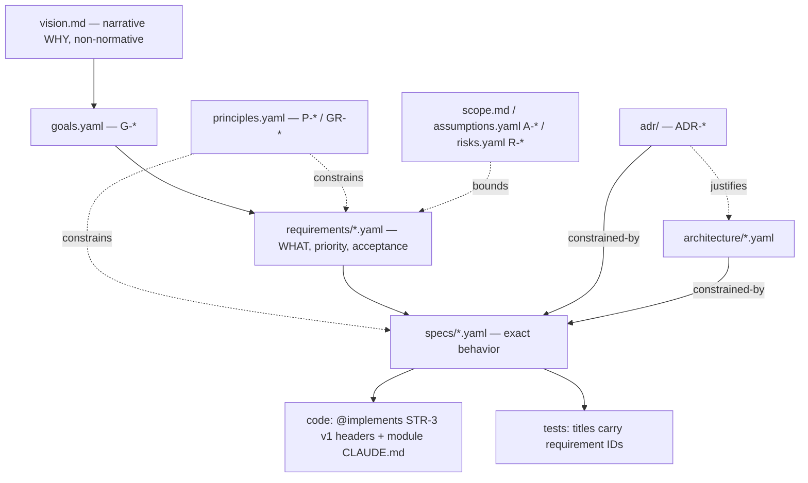

# Documentation System — Router and Change Protocol

This file is the entry point to all project documentation. Read it before creating or modifying **any** artifact — docs or code. The constitution ([/CLAUDE.md](../CLAUDE.md)) mandates spec-first development; this file defines how that works in practice.

## Representation rule

**Normative content is pure YAML; narrative content is markdown.** Registers (goals, principles, requirements, …), specs, and architecture files are `.yaml` — structured records with prose in block scalars, machine-parseable without heuristics. Markdown is reserved for documents meant to be *read as documents*: [product/vision.md](product/vision.md), [product/overview.md](product/overview.md), ADRs, and these `CLAUDE.md` routers. **IDs are defined only in YAML; markdown only references them.**

## Layer model

Each layer owns exactly one question. A layer references neighbors by ID or link — it never restates their content (single source of truth).



| Question | Single source | IDs |
|---|---|---|
| Why does this product exist? | [product/vision.md](product/vision.md) (narrative, non-normative) | — |
| What are the goals and success metrics? | [product/goals.yaml](product/goals.yaml) | `G-*` |
| What principles and guardrails govern everything? | [product/principles.yaml](product/principles.yaml) | `P-*`, `GR-*` |
| What is in/out of scope? | [product/scope.md](product/scope.md) | — |
| Who are the users? | [product/users.md](product/users.md) | — |
| What do we assume/depend on? | [product/assumptions.yaml](product/assumptions.yaml) | `A-*` |
| What can go wrong? | [product/risks.yaml](product/risks.yaml) | `R-*` |
| What ships when? | [product/roadmap.md](product/roadmap.md) | — |
| What decisions are pending? | [product/open-questions.yaml](product/open-questions.yaml) | `Q-*` |
| What contradictions were detected? | [product/inconsistencies.yaml](product/inconsistencies.yaml) | `INC-*` |
| What did a human decide (HITL log)? | [product/decisions.yaml](product/decisions.yaml) | `DEC-*` |
| What operational/compliance/deployment context binds us? | [product/constraints.yaml](product/constraints.yaml) | `CON-*` |
| What has this project learned the hard way? | [learnings.yaml](learnings.yaml) | `LRN-*` |
| What does each domain term mean? | [product/glossary.yaml](product/glossary.yaml) | — |
| WHAT must each capability do? | [product/requirements/](product/requirements/) `*.yaml` | capability prefixes |
| EXACTLY how must it behave? | [specs/](specs/) `*.yaml` | `behavior:` keyed by requirement IDs |
| Cross-cutting technical truth | [architecture/](architecture/) `*.yaml` | — |
| Why this technical choice? | [adr/](adr/) | `ADR-*` |
| Where is X implemented? | each `src` module's `CLAUDE.md` + code headers | — |

**Precedence (conflict resolution):** `GR-*` > `P-*` > requirements > specs. A lower layer may only *tighten* an upper layer, never loosen it. A conflict that cannot be resolved by precedence becomes an `INC-*` entry.

## ID grammar

An ID matches `^[A-Z]{1,4}-\d+$` and is **defined exactly once** — as a key of an `items:` map in its prefix's owning YAML file (`v:` is the item's version), or by an ADR filename `adr/NNNN-slug.md`. Everything else that mentions an ID is a *reference*; `grep -rn "STR-3" .spec src` returns the full trace: definition → spec behavior → implementation → tests.

Register shape (see any file under [product/requirements/](product/requirements/) as the example):

```yaml
kind: requirements          # goals | principles | … | requirements
prefix: STR                 # ID namespace(s) this file owns
title: Posting Strategy
status: approved            # draft | approved | superseded
serves: [G-2]               # file-level default; items may override
intent: >-
  Why this capability exists, in one paragraph.
items:
  STR-3:
    v: 1                    # item version — bump on any semantic change
    priority: P0            # requirement items only (P0 | P1 | P2)
    flexibility: hard       # optional: hard | preference
    serves: [G-2]           # optional override of the file default
    depends: [GEN-5]        # optional explicit dependency edges
    source: PRD v0.3 §7     # optional provenance
    title: Enforcement
    statement: >-
      The requirement text. EARS-style where natural.
    acceptance: Optional testable criterion.
```

`Q-*`/`INC-*` items carry `status: open | resolved` instead of `priority`. Spec files reference requirement IDs as keys of a `behavior:` map (no `v` there — the definition lives in the register); pin a version inside text as `STR-3 v1` when it matters.

## Versioning and immutability

An item is immutable per version. Any **semantic** change bumps `v` (typo fixes don't). Bumping starts a **cascade**: every artifact, code header, or test citing the old pin is stale and must be revisited before commit — `scripts/docs-check.mjs` prints the cascade list and fails on stale pins. History lives in git; files hold only the active version. Unpinned references always mean "current version".

## Prefix registry

New prefixes are registered here **before** first use (`docs-check` rejects unregistered ones).

| Prefix | Owns | Defined in |
|---|---|---|
| `G` | Goals | product/goals.yaml |
| `P` | Product principles | product/principles.yaml |
| `GR` | Platform guardrails | product/principles.yaml |
| `A` | Assumptions | product/assumptions.yaml |
| `R` | Risks | product/risks.yaml |
| `Q` | Open questions | product/open-questions.yaml |
| `INC` | Inconsistencies | product/inconsistencies.yaml |
| `DEC` | Human-in-the-loop decisions | product/decisions.yaml |
| `CON` | Operational / compliance / deployment constraints | product/constraints.yaml |
| `LRN` | Engineering learnings (gotchas, dead-ends, patterns) | learnings.yaml |
| `ONB` | Lazy onboarding | product/requirements/onb-onboarding.yaml |
| `MEM` | Org Memory | product/requirements/mem-org-memory.yaml |
| `CHT` | Agentic chat | product/requirements/cht-agentic-chat.yaml |
| `INT` | Interviewer | product/requirements/int-interviewer.yaml |
| `STR` | Posting Strategy | product/requirements/str-posting-strategy.yaml |
| `GEN` | Content generation | product/requirements/gen-content-generation.yaml |
| `EXT` | External radar | product/requirements/ext-external-radar.yaml |
| `APR` | Approval inbox & composer | product/requirements/apr-approval-inbox.yaml |
| `PUB` | Publishing | product/requirements/pub-publishing.yaml |
| `PRO` | Proactive manager | product/requirements/pro-proactive-manager.yaml |
| `STW` | Stewardship loop | product/requirements/stw-stewardship.yaml |
| `AUT` | Autonomy system | product/requirements/aut-autonomy.yaml |
| `BIL` | Billing & account | product/requirements/bil-billing.yaml |
| `OPS` | Operations console | product/requirements/ops-console.yaml |
| `UX` | App shell & navigation | product/requirements/ux-app-shell.yaml |
| `DCX` | docs-check tool | specs/dcx-docs-check.yaml |
| `CTX` | Context hooks | specs/ctx-context-hooks.yaml |
| `ADR` | Decision records | adr/NNNN-slug.md (ID from filename) |

## Semantic clarity rule

[product/glossary.yaml](product/glossary.yaml) is the authoritative vocabulary. Never use one word for two concepts; when a term is overloaded, qualify it (`auth token`, not `token`). New domain concepts are added to the glossary in the same change that introduces them.

## The SDLC protocol

Governs how every request becomes a change. Three phases: **A — Intake** (evaluate the request against the docs *before* acting), **B — Execution** (make the change), **C — Escalation** (when something can't be built as specified, push back *up* the layers). Steps are annotated with their enforcement mechanism: `[lint]` (docs-check errors), `[hook]` (Claude Code hooks), `[evidence]` (a lint-checked record must exist), `[skill]` (the `/change-request` runnable procedure), or `[prose]` — **prose-only steps are acknowledged debt**: when one is violated in practice, the fix includes either a new check or an `LRN`/ADR record of why it stays prose.

### Phase A — Intake (front door). Runs on every *substantive* request, before any edit. `[skill: /change-request | hook: intake reminder | prose]`

- **A1 Classify** the request: *question* · *bug* · *new-requirement* · *change-to-existing* · *preference* · *technical-decision*. The class selects the path (a question is answered from docs; a bug enters triage B7; a preference is applied narrowly and, if a pattern emerges, proposed as a principle).
- **A2 Evaluate against the docs first.** Load the governing layers — goals, principles/guardrails, scope, and the relevant requirements/specs by ID. **Form no proposal before this load.** (The CTX-2 hook resolves mentioned IDs; the intake hook reminds; the write-guard (CTX-5) blocks writing against unloaded contracts.)
- **A3 Contradiction check → pushback.** Does the request conflict with a goal / principle / guardrail / scope boundary / existing requirement? If yes **and the user did not explicitly override it**, **STOP: surface the contradiction citing IDs and request an explicit decision (AskUserQuestion).** Precedence sets severity: a `GR` guardrail is near-immovable (needs a deliberate guardrail change); `P`/goal/scope/`flexibility: hard` requirement → mandatory HITL; a `flexibility: preference` item → the agent may propose a resolution. Record the contradiction as `INC-*` and its resolution as a `DEC-*`.
- **A4 Gap check → ask, then store.** Is there enough information to design (compliance, deployment/environment, usage mode, integration facts, edge cases, NFRs)? Missing high-importance info → **ask the user, then store the answer** in its register: operational/compliance/deployment/usage facts → `CON-*`; external bets → `A-*`; product behavior → a requirement. Low-importance gaps → fill from a principle, note as an open `Q-*`, and flag the derivation `inferred`.
- **A5 Flexibility check → proactive heads-up.** Does implementing require a one-way-door / flexibility-limiting technical decision (data-model shape, external lock-in, a public contract, the auth model), a brown-phase change (once there are production users/data), or something that forecloses a deferred/vision direction ([product/scope.md](product/scope.md))? → **proactively tell the user, propose an ADR, and get the decision** — do not wait to be asked, and do not quietly pick the convenient one-way door.
- **A6 Proceed** to Phase B only once A2–A5 are clear.

### Phase B — Execution. `[per-step annotations below]`

1. `[lint: pins, cascades]` **Behavior change (new or modified):** edit the requirement/spec **first**. Semantic edit ⇒ `v` bump ⇒ spec status regresses to `draft` until re-approved. Spec + code + tests land in the same commit.
2. `[lint + evidence]` **Design gate (spec approval prerequisites):** a spec may flip to `approved` only when **(a)** its `design-scope`/`constrained-by` satisfy DCX-11 — cross-cutting specs cite accepted ADRs and/or approved architecture docs; `design-scope: local` is an explicit, greppable claim, never an omission; **(b)** its `design` section is filled (DCX-12); and **(c)** the **Architect Challenger has been invoked**, its verbatim verdict stored as a challenge record, and the `challenge:` block points at it (DCX-13) — see the challenge policy in [specs/CLAUDE.md](specs/CLAUDE.md); a `fail` verdict keeps the spec in `draft` until findings are resolved and it is re-challenged.
3. `[prose]` **Design altitude rule:** a design choice affecting more than one capability is an **ADR + architecture doc** entry; a choice local to one capability lives in that spec's `design` section, derived from (and citing) the cross-cutting layer.
4. `[lint: stale pins, ADR statuses]` **Cascade analysis:** after a version bump, `docs-check` lists every citing site; each must be revisited (updated or consciously re-pinned). Superseding an accepted ADR cascades the same way: every spec citing it goes red (DCX-11) until re-pointed.
5. `[hook: CTX-5 write-guard | prose beyond it]` **Contradiction check:** before writing, load the target file's `depends-on` set, every file referencing the edited IDs (one grep), applicable principles, and open `INC-*` entries touching those IDs. A contradiction you cannot resolve in this change becomes a new `INC-*` entry — contradictions are never silently dropped.
6. `[lint: statuses | prose: judgment]` **New technical decision with alternatives:** write an ADR. Never overturn an `accepted` ADR silently — supersede it. A `rejected` ADR is a binding constraint; do not re-propose without new information.
7. `[prose]` **Bug triage — fix at the layer that failed:** every bug is a *spec gap* (amend spec, then code), a *spec violation* (fix code, cite spec), a *wrong spec* (supersede via this protocol), or a **design gap** — implementation legitimately cannot conform to the cited design; route it upstream to a new or superseding ADR, never let the spec quietly diverge from architecture.
8. `[prose]` **Unspecified case hit during implementation:** derive the answer from a principle (record the derivation in a code comment citing `P-x`), or raise a spec amendment. Never invent silently.
9. `[prose]` **Altitude rule:** spec an item only if a reasonable implementation could plausibly get it wrong. If any reasonable implementation is acceptable, cite the governing principle instead of enumerating cases. If being wrong would be invisible in review, spec it with an acceptance criterion. Priorities live only on requirements.
10. `[prose]` **Learning deposit:** any multi-round fix loop, reverted approach, or diagnosed tooling bug records its transferable lesson as an `LRN-*` entry in [learnings.yaml](learnings.yaml) **in the same commit** (type: gotcha / dead-end / pattern, scope-tagged, incident-sourced). Module-local traps go to the module `CLAUDE.md` Gotchas section instead. Dead-ends are binding like rejected ADRs: not re-proposed without new information.
11. `[prose]` **Refactor with no behavior change:** no spec edit; update the affected module `CLAUDE.md` if structure moved.
12. `[lint + hook: pre-commit]` **Every change ends with:** `node scripts/docs-check.mjs` green (plus typecheck and biome once code exists). The pre-commit hook enforces this (DCX-14) — a red graph cannot be committed; pre-push additionally runs the acceptance harness (DCX-15).

### Phase C — Escalation (back door). When something cannot be built as specified, push back *up* the layers rather than diverging quietly. `[prose + lint: DCX-16 gates the top of the ladder]`

- **The ladder:** code blocker → **spec** (spec gap / wrong spec — triage B7) → **design** (design gap → new or superseding ADR — B7) → **requirement** (the requirement itself is infeasible or contradicted by reality, e.g. an external API changed).
- Record the blocker-vs-reality conflict as an `INC-*`; resolve it *downward* through Phase B (with cascade). Each rung is tried before climbing to the next — you escalate to the requirement level only when spec and design genuinely cannot absorb the blocker.
- **A requirement-level change is never made autonomously** — it requires HITL confirmation recorded as a `DEC-*` (and DCX-16 enforces that the changed requirement item cites it). This closes the loop: reality can force a requirement to change, but only a human authorizes it.
- Escalations that are **deferred or rejected** are retained so they are not silently re-raised: rejected → an `LRN` dead-end; deferred → an open `Q-*`.

### HITL policy

Who decides what. Right-sized for a two-founder product; the decisive artifact is the `DEC-*` log.

- **Agent-autonomous (no ask):** reversible changes within already-approved scope / requirements / specs; filling low-importance gaps from a principle (flagged `inferred`); narrow preference-level redirects; anything a challenge or lint already gates.
- **Must escalate to the user (AskUserQuestion mandatory), recorded as a `DEC-*`:** contradicting a guardrail / principle / goal / scope / `flexibility: hard` requirement (A3); any requirement **semantic change or removal** (Phase C); a flexibility-limiting / one-way-door decision (A5); a high-importance unspecified aspect (A4); any genuine business or product call.
- A `DEC-*` records the decision (`statement`), `by` (who), `date` (when), and what it binds/overrides/authorizes (`binds:`, and links to the `INC` it resolves or the requirement/ADR it authorizes). `DCX-16` gives the citation teeth: a requirement/goal/principle bumped to v≥2, or added with no provenance marker, fails the lint unless it carries `decided-by: DEC-x`; the v1 founding baseline carries `origin: baseline` instead. Note the residual (LRN-13 class): `origin: baseline` is a conscious, greppable, diff-reviewable claim the lint can't verify against the true founding set — a *new* item dishonestly tagged baseline passes the lint and is caught only in review, exactly like a dishonest `design-scope: local`. Teeth on the common cases; judgment on that one.

## Enforcement stages

- **Stage 0 (live):** this protocol + `docs-check` + the **pre-commit/pre-push git hooks** (DCX-14) + **Claude Code hooks** ([specs/ctx-context-hooks.yaml](specs/ctx-context-hooks.yaml)): every docs edit is linted at the moment it happens (CTX-1); IDs mentioned in prompts resolve into context automatically (CTX-2, bounded by CTX-3); no Edit/Write tool call touches a contract the session never loaded (CTX-4, CTX-5); the **intake protocol is made ambient** each session (CTX-6) with the `/change-request` skill as its runnable form; **HITL sign-off is structural** — a product-altitude change without a `DEC-*` fails the lint (DCX-16); and the **Architect Challenger is mandatory at every spec approval** (DCX-13).
- **Stage 1 (repo skeleton):** `docs-check` in CI; a spec may claim `implemented` only with ≥1 code citation and ≥1 test citation of its IDs.
- **Stage 2:** stale-pin detection extends over `src/` code headers (`@implements STR-3 v1`) and test titles — drift cannot pass CI.
- **Stage 3 (optional):** on spec diffs after approval, an adversarial re-review of the edited file against everything referencing its IDs.

## Folder map

- [product/](product/) — business truth: vision, goals, principles, scope, requirements
- [learnings.yaml](learnings.yaml) — engineering learnings: gotchas, dead-ends, patterns (`LRN-*`)
- [specs/](specs/) — behavior specs, written just-in-time before a capability's code starts; [specs/challenges/](specs/challenges/) holds challenge evidence
- [architecture/](architecture/) — cross-cutting technical truth (approving its sketches is the first task of the design pass — a hard predecessor of spec approval, DCX-11)
- [product/decisions.yaml](product/decisions.yaml) — HITL decision log (`DEC-*`); [product/constraints.yaml](product/constraints.yaml) — operational/compliance/deployment constraints (`CON-*`)
- [adr/](adr/) — decision journal (markdown)
- `../scripts/` — `docs-check.mjs` (lint), `lib/docs-graph.mjs` (shared parser), `hooks/` (Claude Code hooks), `test-docs-check.mjs` (acceptance)
- `../.claude/skills/change-request/` — the runnable intake procedure (Phase A)
