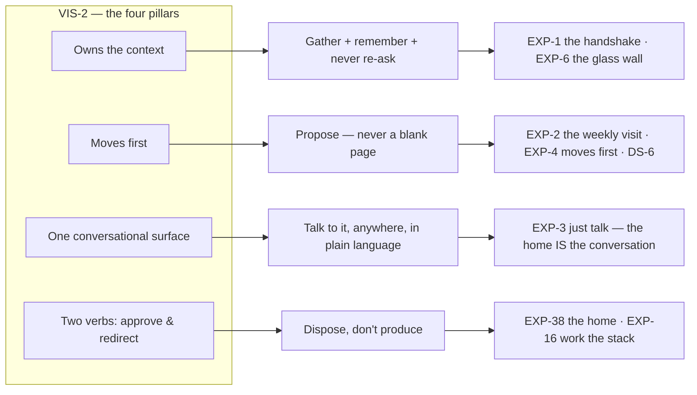

# Vision → Experience Map

The orthogonal view of the spine. `experience/spine.yaml` (the One-Home model,
DEC-18) organises journeys by the **trust arc + satellites**. This document
provides the cross-cut: how each **VIS-2 north-star pillar** and the vision's
core promises are actually realised by journeys, requirements, and design
rules — so the vision→experience thread is *legible*, not merely inferable
from `serves:` edges. Source of truth stays the cited IDs; this is a router,
not a new register.

## The four pillars, realised

| VIS-2 pillar | What it means for the founder | Where it lives (cite) |
|---|---|---|
| **Owns the context** — gathers everything knowable without asking, remembers permanently | The system reads the org's public presence and files it; it asks only what it cannot find, and never twice. | Ingestion **ONB-2** narrated in **EXP-11**; permanent memory **MEM-1** (a stated correction is never violated again); never-ask-twice **MEM-2** + AssumedNotes (**EXP-12**, DS-5); the interview fills only real gaps **INT-1..3 / EXP-12**; progressive enrichment **INT-4 / EXP-20**; the glass wall **EXP-6 / EXP-30**. |
| **Moves first** — proposes, never a blank page | The founder never faces an empty canvas or a "create from scratch" prompt. Work arrives already drafted, in a home that always speaks first. | Hard design rule **DS-6** + value **VAL-6**; the visit arrives pre-drafted **EXP-2/EXP-15**; proactive work **PRO-1..3 / EXP-4**, campaigns **EXP-24**, photo requests **EXP-22**; the composer is never blank (**CHT-5 / EXP-18**); Compose is an action, never a place (**UX-7**). |
| **One conversational surface** — aware of everything | Talking is not a destination — the home IS the conversation; the work arrives inside it, and every card is talkable in place. | The fused stream (**DEC-18**, **EXP-3 / EXP-38**); full-context chat **CHT-1..5**; the guided Adjust **EXP-19**; the enrichment loop **EXP-20**. This resolves the old "chat as primary vs. home-first" tension structurally: the conversation and the home are the same surface. |
| **Two verbs — approve & redirect** | The founder's whole job. **Approve** is the one accent action; **Adjust / Skip** are facets, plain and consequence-clear (VAL-6 v2), and **Redirect** is "just tell it." | **APR-1 / EXP-16 / EXP-38** (Approve is the single accent verb per card, DS-2); Adjust/Skip/Redirect route to the learning loop **EXP-19/EXP-20** + **CHT-2** (confirm-back → permanent rule). |

**Outcome the pillars produce:** an unbroken **stewardship rhythm** (**G-4**,
**EXP-17**) — the sector's default of "going dark" replaced by steady presence,
spoken as "steady presence", never a streak score (DEC-16).

## The One-Home guarantees (DEC-18)

- The home always reaches an honest **"caught up"** (EXP-17) — finite by
  design at the typical ~1-item/day cadence (typical, not a cap — DEC-20;
  campaign bursts compress to one package card).
- **Holds and failures pin** (EXP-27, EXP-38) — never batch-cleared, never
  scrolled away; GR-3 keeps a face at every trust level.
- The morphing home keeps **one invariant skeleton** (EXP-38) — density
  changes, layout never does.
- The **glass wall is one click, always** (EXP-6): Knowledge · How I write ·
  Plan & Published · Discoveries — pull-only, plain-labeled, never chat-gated
  (VAL-3); trust offers glimpse it proactively (EXP-25).

## The lazy / zero-homework onboarding, as one line

Journey **EXP-1** ("Day one — the handshake"), founder-paced, nothing gated:

`sign up — name + email only (ONB-1, EXP-40)` → `watch it learn — the home
narrates while it works (ONB-2, EXP-11)` → `the first conversation — correct,
don't produce (INT-1/2, ONB-5, EXP-12)` → `first drafts, first yes — channel
connected in context (ONB-6, ONB-4, EXP-13)` → `meet the plan — offered, never
gated (STR-2, EXP-14)`.

**Honest floor:** zero-homework holds when the org has an ingestable
web/social presence. For the thinnest-source orgs the arc becomes
**interview-first** (**INT-1/INT-2, EXP-12**) — the one place the founder
supplies raw material, in their comfort zone (talking). Scoped by DEC-17:
"zero-homework" means no *blocking* homework; gaps fill progressively via
**INT-4 / EXP-20** — never a gate.

## Historical reconciliations (resolved)

1. **Primary surface** — resolved structurally by DEC-18: the conversation
   and the home are one fused surface (EXP-3/EXP-38), led by the system
   (CHT-5). The DEC-7-era "home-first with a docked companion" framing is
   superseded.
2. **"Two verbs"** — resolved by VAL-6 v2 (DEC-17): disposition-not-production
   essence; Adjust/Skip are facets, plain and consequence-clear (VAL-5, R-10).
