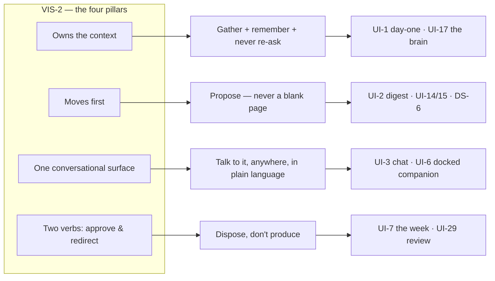

# Vision → Experience Map

The orthogonal view of the spine. `experience/ui.yaml` organises journeys by
**relationship chapter** (day-one, weekly rhythm, earned autonomy…). This
document provides the missing cross-cut: how each **VIS-2 north-star pillar**
and the vision's core promises are actually realised by journeys, requirements,
and design rules — so the vision→experience thread is *legible*, not merely
inferable from `serves:` edges. Source of truth stays the cited IDs; this is a
router, not a new register.

## The four pillars, realised

| VIS-2 pillar | What it means for the founder | Where it lives (cite) |
|---|---|---|
| **Owns the context** — gathers everything knowable without asking, remembers permanently | The system reads the org's public presence and files it; it asks only what it cannot find, and never twice. | Ingestion **ONB-2** narrated in **UI-22/UI-48**; permanent memory **MEM-1** (a stated correction is never violated again); never-ask-twice **MEM-2** + AssumedNotes (**UI-24**, DS-5); the interview fills only real gaps **INT-1..3 / UI-23**; the glass wall **UI-17 / UI-43**. |
| **Moves first** — proposes, never a blank page | The founder never faces an empty canvas or a "create from scratch" prompt. Work arrives already drafted. | Hard design rule **DS-6** (no empty states) + value **VAL-6**; the digest arrives pre-drafted **UI-2**; proactive work **PRO-1..3**, campaigns **UI-15**, photo requests **UI-14**; Compose is deliberately *not* a nav destination (**UX-7**). |
| **One conversational surface** — aware of everything | Talking to it is always one gesture away, on every screen, with full context. | Full-context chat **CHT-1..4**; the chat surface **UI-9 / UI-3**; a docked companion present across every journey **UI-6** (DEC-7: inbox-first shell *with* the always-summonable companion). |
| **Two verbs — approve & redirect** | The founder's whole job. **Approve** is the one primary action per screen; **Edit / Skip** are facets of it, and **Redirect** is "just tell it" in plain language — all fold into the same learning loop. | **APR-1 / UI-7** (Approve is the single accent action, DS-2); Edit/Skip/Redirect route to the learning loop **UI-29** + **CHT-2** (redirect → confirm-back → permanent rule). |

**Outcome the pillars produce:** an unbroken **stewardship rhythm** (**G-4**,
UI-31) — the sector's default of "going dark" replaced by steady presence.

## The lazy / zero-homework onboarding, as one line

Journey **UI-1** ("Day one — hired"), founder-paced and every step skippable
(not a wizard):

`sign up — name + email only (ONB-1, UI-21)` → `watch it learn — it narrates
while it works (ONB-2, UI-22/48)` → `here's what I know — correct, don't
produce (ONB-5, UI-24/49)` → `meet your strategy — auto-drafted (STR-2, UI-25)`
→ `connect channels — any order, non-gating (ONB-4, UI-26)` → `first drafts
arrive (ONB-6, UI-27)`.

**Honest floor (to state plainly, per the audit):** zero-homework holds when the
org has an ingestable web/social presence. For the newest, thinnest-source orgs
the arc becomes **interview-first** — a gentle, few-questions-at-a-time
conversation (**INT-1/INT-2, UI-23**), the one place the founder supplies raw
material. It lands in the persona's comfort zone (talking, not marketing tools). Scoped
by DEC-17: "zero-homework" means no *blocking* homework, and the gaps are filled
progressively via **INT-4** (a gentle, always-available set of open questions) —
never a gate; the glossary "Lazy onboarding" now states this.

## Two reconciliations (vision text vs. built spine) — resolved by DEC-17

1. **Primary surface.** vision.md frames chat as *the primary interaction
   model*; **DEC-7** made the shell the **Ready**-first surface *with* a docked
   chat companion. Resolved: chat is the always-**proactive, leading**
   conversational layer (**CHT-5**) — the founder mostly *answers*, and it is
   never a blank surface they must drive. "Primary" is squared as "the
   conversational layer that leads," not "the home surface."
2. **"Two verbs."** VIS-2/VAL-6 promise two verbs; the surface shows more
   actions. Resolved (**VAL-6 v2**): "two verbs" is the disposition-not-
   production *essence* (approve / redirect); Edit/Adjust and Skip are facets,
   kept minimal, plain, and consequence-clear — never technical (VAL-5, R-10).
