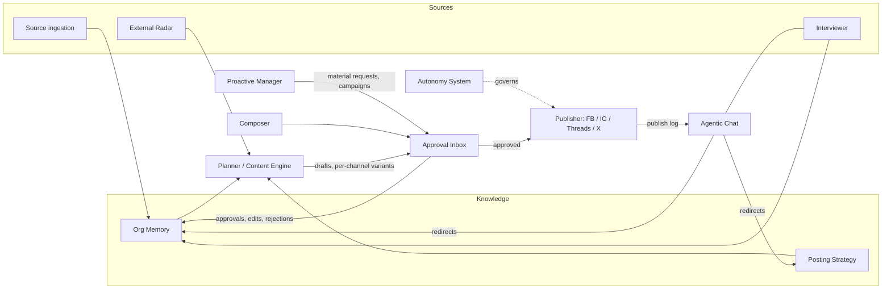

# Steward — System Concept

Steward is a near-autonomous AI content manager for small US 501(c)(3) nonprofits. The system learns the organization from whatever exists (lazy onboarding + curious interviewer), keeps an explicit founder-editable Posting Strategy, plans and writes content across an internal/external taxonomy, adapts every post per channel, publishes to Facebook, Instagram, Threads, and X, and can be *talked to* through one context-aware chat. The founder approves, redirects, and occasionally chats; the system does the work.

Scope discipline: **content in, content out** — no engagement handling, leads, or donation infrastructure in this release (see [scope.md](scope.md)). Constraints: two technical founders, first paying customer in ≤3 months, built from scratch. Price: $199/month.

## The core loop

**Org Memory** (facts, stories, media, rules) and the **Posting Strategy** (explicit editorial contract) feed the **Planner/Content Engine**, which drafts from two wells — *internal* org content and the *external radar* — producing per-channel adapted variants. Drafts flow to the **Approval Inbox** (or originate in the **Composer**), then to the **Publisher** (fit-gated). The **Agentic Chat** sits across everything — it hosts the **Interviewer**, answers questions, takes redirects, and (Phase 2) executes commands. The **Proactive Manager** requests material and proposes campaigns; the **Autonomy System** governs what may publish without approval. Every founder action enriches Memory, so the loop compounds.

The requirement capabilities in [requirements/](requirements/) map onto these blocks; the technical module boundaries live in [../architecture/overview.yaml](../architecture/overview.yaml).
