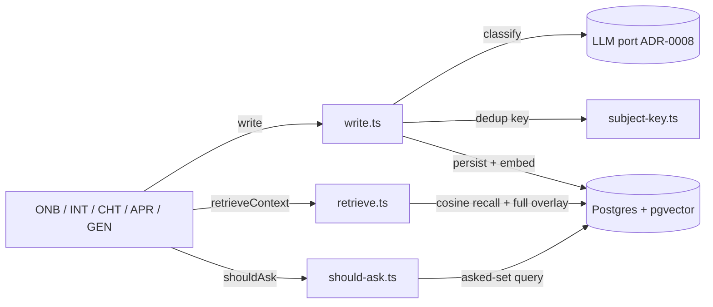

# backend/src/memory/ — `@backend/memory` (ARC-11)

**Purpose.** The org-memory read/write layer — PIPE-1's "one brain, several
skills". The single store every enriching capability writes through (ONB, INT,
CHT, APR, GEN, EXT, BOT) and every generating capability retrieves from. Memory
is the SINGLE source of founder rules/taboos (DEC-22). Implements the behaviour
spec **MEMS** (`.spec/specs/mem-org-memory.yaml`).

**Spec coverage.**

| File | Implements |
|---|---|
| `write.ts` | MEMS-1 (single write path, taxonomy, correction-channel policy, reinforcement) + MEMS-2 (merge/supersede) |
| `subject-key.ts` | MEMS-2 / MEMS-6 deterministic canonical-subject key (zero false-match) |
| `retrieve.ts` | MEMS-4 (grounded retrieval + full active overlay + empty-memory thinness) |
| `should-ask.ts` | MEMS-5 (interrupt-or-assume) + MEMS-6 (never-ask-twice asked-set) |
| `index.ts` | The `createMemory(db, llm)` facade — the surfaces in the spec's `interfaces` block |

**Data.** DM-2 `memoryEntry` (the single-source table, `@shared/db/memory.ts`,
DEC-39), owned by Org (DM-1). The asked-set and the active rule/taboo overlay are
DERIVED indexes over MemoryEntry (queries), never separate entities.

**Boundaries / scope.**
- All model + embedding calls go through the **LLM port** (`../ports/llm.ts`,
  ADR-0003/ADR-0008) — never a vendor SDK here.
- Every query is **org-scoped** (ACC-3); `purgeOrg` is the only hard delete
  (wrong-org escape + BIL-2, SEC-4).
- The overlay's **VAL-stage enforcement** (MEMS-3) is the consumer's job
  (PIPE-2 / GEN) when that vertical lands — this module assembles + returns the
  overlay (MEMS-4), it does not gate drafts.

**Gotchas.**
- Tables import via the `@shared/db/schema.js` alias (needs the `.js`,
  NodeNext); types via `@shared`. The `@steward/shared/db/*` package export is
  only for CLI/tooling loaders (drizzle-kit, better-auth CLI).
- Row ids are generated in the write path (`node:crypto` `randomUUID`) because
  `@shared` stays node-free (the table has no `$defaultFn`).
- A row is ACTIVE iff `supersededAt IS NULL`; never hard-delete on a correction.

<!-- cortex:folder-context (generated by `cortex context` — do not edit inside) -->
## Folder spec context
_Generated from `.spec/` (references only — the registers are the source of truth). Run `cortex context` to refresh._

**Requirements this folder realizes:**
- MEM-1 — Memory persistence (.spec/product/requirements/mem-org-memory.yaml)
- MEM-2 — Never-ask-twice (.spec/product/requirements/mem-org-memory.yaml)

**Spec-elements:** MEMS-1, MEMS-2, MEMS-4, MEMS-5, MEMS-6

**Governed by:**
- GR-8 — Stated-correction enforcement (.spec/product/guardrails.yaml)

**Conventions scope:** backend (see .spec/conventions.yaml)

<!-- /cortex:folder-context -->
