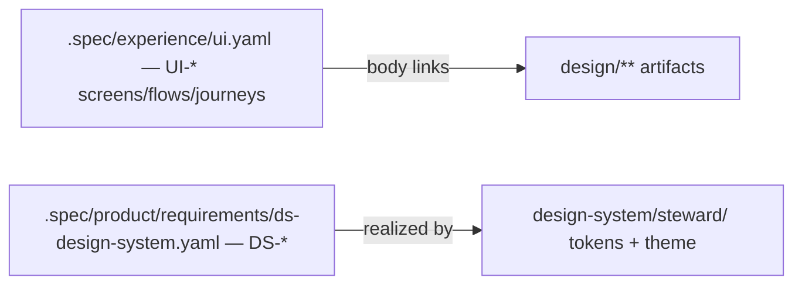

# design/ — Design Artifacts

Visual/UX artifacts that cannot live in `.spec/` YAML (method/ui.md): design
systems, and — as the design pass produces them — Claude Design mockups and
wireframes. **The addressable node is always a design-element in
`.spec/experience/ui.yaml` (UI-*); files here are its attachments**,
linked from the owning element's `body`. Never the reverse.

## Structure

- [design-system/](design-system/CLAUDE.md) — the token-based design system:
  vendored Airbnb substrate + the Steward theme (ADR-0001, DEC-6/DEC-7).
- `mockups/` *(arrives with the Claude Design pass)* — screen mockups, one
  folder per UI-* element. Each folder's `PROVENANCE.md` records the owning
  design-element (UI-*); the design-system `preview/` files carry
  `<!-- @implements DS-* -->` markers and participate in the evidence graph.
  (Screen mockups gain `@implements UI-*` markers when they become code-level
  evidence; today ownership lives in PROVENANCE.md.)

## Rules

- Mockups and components resolve style exclusively via the steward theme
  tokens (DS-1) — never raw values, never the airbnb reference directly.
- Airbnb brand marks (Rausch coral, Cereal VF, wordmark) never appear in
  Steward surfaces (ADR-0001 consequences).
