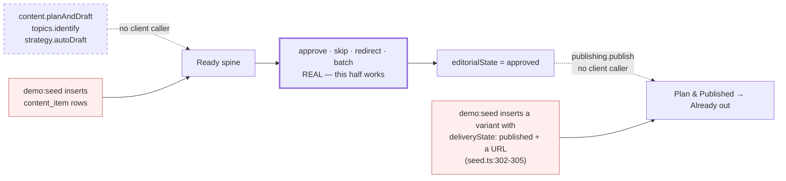

# F0b — Reachability matrix

**Question this pass answers.** For each founder-visible story and journey: can a
real founder reach it from a fresh signup, with an empty database and no
`demo:seed`?

**Why it comes first.** A perception finding on an unreachable surface is moot
until the surface can be reached. Phase E's evidence was collected almost
entirely against the seeded org, so "the state renders correctly" was never the
same claim as "a founder can get there."

**Method.** Static trace of every tRPC procedure the client calls
(`rg -o "trpc\.[a-z]+\.[a-zA-Z]+" client/src | sort -u` → 44 procedures), against
the server-side preconditions of each state. Confirmed from the founder's chair
in F1.

Legend: **✅ reachable** · **⚠️ compose-only** (reachable only because the founder
wrote the content themselves) · **❌ unreachable** (no sequence of clicks produces
the state) · **🌱 seed-only** (the state exists in evidence solely because
`demo:seed` inserted the row).

---

## The two fabricated ends

The Ready spine's *disposal* half is real and works. Both ends around it are not.

**Entry.** `client/src` has zero callers of `content.planAndDraft`,
`topics.identify` or `strategy.autoDraft`. The chain no-ops anyway —
`planCalendar` returns `[]` on an empty agenda (`backend/src/content/planner.ts:148`)
and only `topics.identify` fills the agenda.

**Exit.** `publishLog` returns only `channelVariant` rows with
`deliveryState: "published"` (`backend/src/publishing/publish.ts:144-150`). The
only writer of that state is `publishVariant`, reached solely through
`publishing.publish` — **which the client never calls**. Approving an item sets
`editorialState: "approved"` and stops there.

---

## Stories (US-1..19)

| Story | Precondition | Fresh | Note |
|---|---|---|---|
| US-1 The home always presents the same skeleton | chrome + 4 regions | ⚠️ | `Home.tsx:118` — `if (!children) return null`. With no cards the **pinned region is absent from the DOM entirely**, so "four regions in order" is three. `shell.spec.ts` runs fresh and passes, so it cannot be asserting all four are present |
| US-2 A summoned view opens beside the home | any glass-wall view | ✅ | |
| US-3 A held card stays reachable while a pane is open | **a held card** | ❌ | Needs an escalated draft. Nothing generates drafts |
| US-4 Leaving a pane returns her where she was | any pane | ✅ | |
| US-5 The kill switch is always one gesture away | Pause + a pane | ✅ | |
| US-6 Two fields is the whole of signing up | — | ✅ | This *is* the fresh path |
| US-7 Pause is the real switch | — | ✅ | |
| US-8 Day one is the same home, never a wizard | — | ✅ | |
| US-9 The conversation is still there later | interviewer session | ✅ | |
| US-10 The conversation never shows an empty box | `chat.openings` | ✅ | |
| US-11 A standing rule is confirmed back | `previewRedirect` | ✅ | Pure string template, no LLM |
| US-12 The week's stack is finite, and she can see the end | **cards in Ready** | ⚠️ | Only cards she wrote herself |
| US-13 A held card cannot be swept away with the rest | **a held card + ≥1 other** | ❌ | |
| US-14 Skipping asks why afterwards | **a card** | ⚠️ | Compose-only |
| US-15 Opening a draft shows every channel | **a draft with variants** | ⚠️ | Compose-only (`approval.compose` does run `adaptVariant` per channel) |
| US-16 Writing something herself goes through the same checks | — | ⚠️ | Reachable, but the check is holed: `approval/index.ts:229` passes `overlay: []`, so her own taboos are never applied to her own post (GR-8) |
| US-17 She can look inside at any time | four views | ⚠️ | All four open; **all four are empty on a fresh org**, and `strategy.autoDraft` / `radar.discover` have no UI trigger, so two of them can never fill |
| US-18 The controls tell her the truth | — | ✅ | |
| US-19 **The whole loop closes** | draft → approve → **appears in the record** | ❌ 🌱 | Approve sets `editorialState`. Nothing sets `deliveryState: "published"`. "Already out" stays empty forever. The e2e passes only against `seed.ts:302-305` |

**Tally: 9 fully reachable · 7 degraded or compose-only · 3 unreachable.** The two
carrying the product thesis — US-12 (a finite stack of work brought *to* her) and
US-19 (the loop closes) — are both among the fabricated.

---

## Journeys and flows

| Element | Promise | Fresh | Blocker |
|---|---|---|---|
| **XO-2** arrival & watch it learn | *"Steward already narrating ingestion"*, findings stream in as cards | ❌ | Nothing auto-fires. The founder must click **"Yes, start reading"**. No streaming — one binary narration until the mutation resolves |
| XO-2 · failed source | *"your site wouldn't load — I'll retry; meanwhile, tell me…"* | ❌ | `scrapeSite` swallows all errors and returns `[]` (`adapters/sources/fetch.ts:43-49`), so failure resolves as **success with zero findings**. Copy gated on `ingest.isError`, never fires |
| XO-2 · no sources at all | interview becomes the primary path, honestly framed | ⚠️ | The interview works, but the ONBS-5 correction box is nested inside the findings card (`DayOne.tsx:157,179`) — invisible when nothing was learned, i.e. exactly then |
| **XO-3** the first conversation | *"a few questions at a time, never an interrogation"*; every answer visibly landing | ⚠️ | Three questions arrive at once (`PER_TURN_CAP = 3`). Founder must click "Ask me something" — nothing asks unprompted. Exhaustion is **silent**: `nextQuestions` returns `[]`, no message, no state change |
| XO-3 · "here's what I know" | correctable profile card with AssumedNotes | ⚠️ | Renders only with ≥1 Memory entry |
| **XO-4** first drafts, first yes | *"Here are your first drafts — built from your website and our chat"* | ❌ | **No path exists.** This is the root cause |
| XO-4 · connect in context after first approval | channel connect prompted at the moment of first yes | ❌ | Not in the day-one path at all; connect lives only in Controls |
| **XO-5** meet the plan | *"here's how I plan to speak for you"* | ❌ | `strategy.autoDraft` has no UI trigger. "How I write" shows "Not written down yet" + five empty sections; the only way to fill it is to hand-type all five |
| **XH-12** region 1, pinned zone | holds pin and cannot scroll away | ❌ | No holds can exist |
| XH-12 region 2, Ready spine | header contract, finite, one accent verb | ⚠️ | Compose-only |
| XH-12 region 4, terminus | rhythm line, "next from me" | ⚠️ | Renders; the rhythm numeral is 0 weeks |
| **XG-6** Knowledge | what Steward knows | ✅ | Fills from ingest/interview |
| **XG-7** How I write | five-section editorial contract | ❌ | No auto-draft trigger |
| **XG-8** Plan & Published | coming up + already out | ❌ | "Already out" unreachable (above); "Coming up" needs generated drafts |
| **XG-9** Discoveries | things found in your world | ❌ | `radar.discover` has no UI trigger |
| **XA-6** Controls | kill switch, channels, trust dials | ✅ | Honest about what is absent |

---

## Two tier-specific blockers

1. **Keyless, the home can never leave day-one shape.** `readyForFirstDrafts`
   requires a `program` or `story` Memory entry
   (`backend/src/onboarding/index.ts:158`); the dev-stub classifier emits only
   `fact` / `styleRule` / `taboo` (`adapters/llm/dev-stub.ts:77-83`). `isDayOne`
   stays true permanently and the terminus reads *"I'm still thin on you"*
   forever, whatever the founder does. **This is the tier CI and every keyless
   demo runs on.**
2. **No production sign-in exists in the client.** `rg -n "google|oauth" client/src`
   finds nothing; `auth.devLogin` is the only sign-in the UI can call and it
   throws `FORBIDDEN` under `NODE_ENV=production`
   (`backend/src/routers/auth.ts:31-33`). In a production build the Start button
   fails forever.

---

## What this means for the rest of the audit

F1 runs the cold start against **real Gemini**, because the keyless tier cannot
leave day one and would tell us nothing about the product. The runs will confirm
these traces from the founder's chair, and the perception findings gathered along
the way apply only to the ✅ and ⚠️ rows — the ❌ rows have no experience to judge
yet, only an absence to record.
